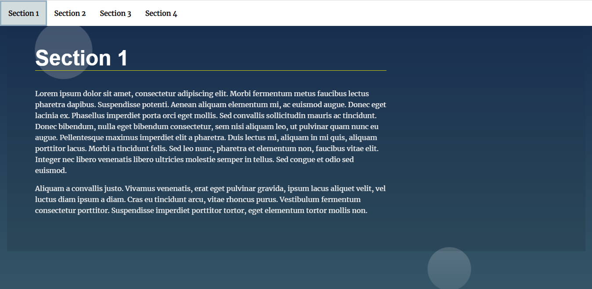

# Landing Page Project

### Overview

This is a project to build a responsive landing page by using Javascript to create a dynamic navigation bar that scrolls to the highlighted sections in the page. The project uses HTML, CSS, and Javascript.

### Instructions

- Navigation is built dynamically as an unordered list.

- Section Active State
  It should be clear which section is being viewed while scrolling through the page.

- Scroll to Anchor
  When clicking an item from the navigation menu, the link should scroll to the appropriate section.

### Description

- Creating a dynamic navigation bar for the sections added to the page. created the navigation link items and links then using a for loop to iterate over all the sections in the html and then appending these elements to a fragment which is the navigation bar (for better performance).

- Smoothly scrolling into the section clicked int the navigation bar by using the scrollIntoView method.

- Detecting which section is into view in the viewport by using the intersectionObserver API and using a for loop to iterate over sections to add the active class to the sections that is into view and removing the class from those that aren't.

- Lastly, using "defer" in the script tag in the html file to wait till the document is fully loaded to execute the js file.

### Prerequisite

- intersectionObserver API is not supported by the internet expolorer browser.

### Demo

### Credits:

https://www.w3schools.com/jsref/met_element_scrollintoview.asp

https://developer.mozilla.org/en-US/docs/Web/API/Intersection_Observer_API

https://css-tricks.com/a-few-functional-uses-for-intersection-observer-to-know-when-an-element-is-in-view/
